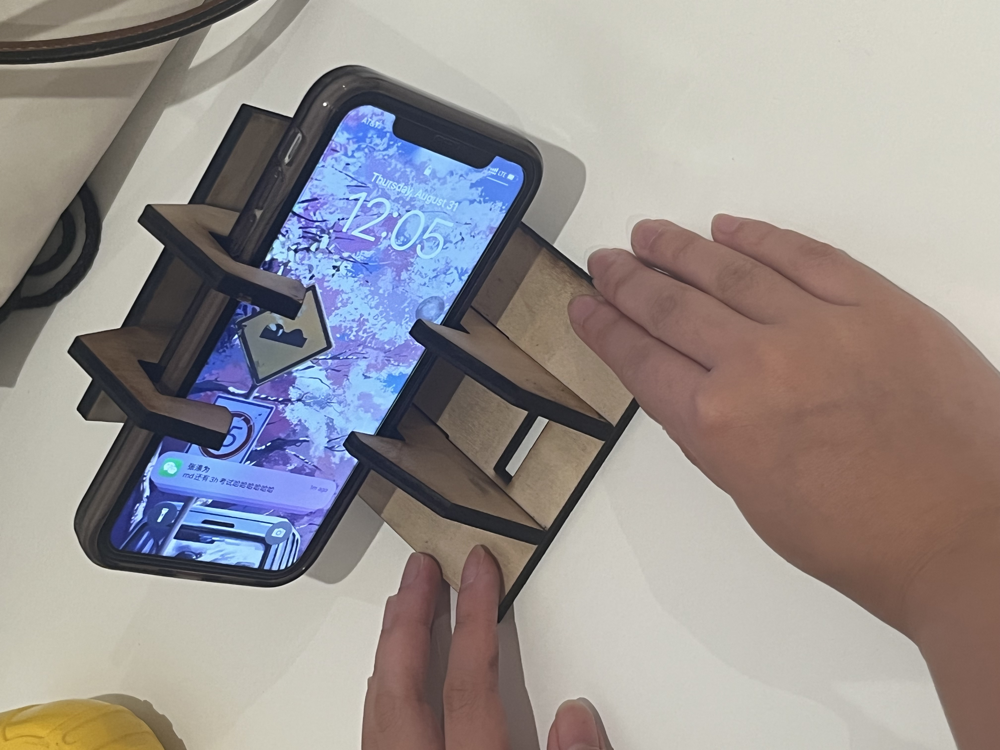
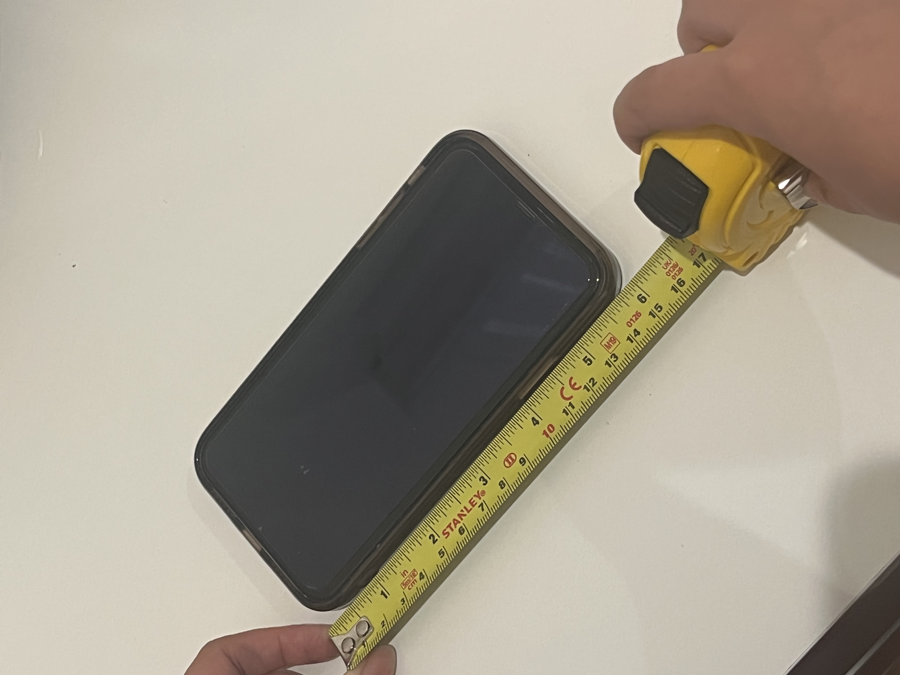
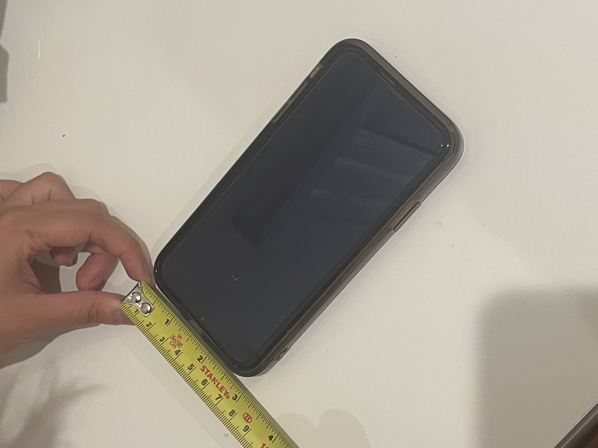
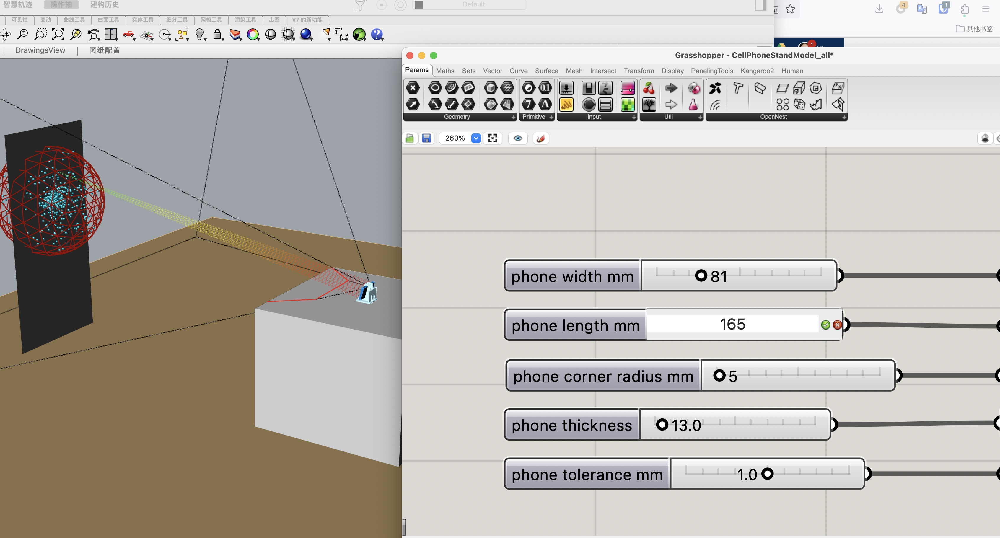
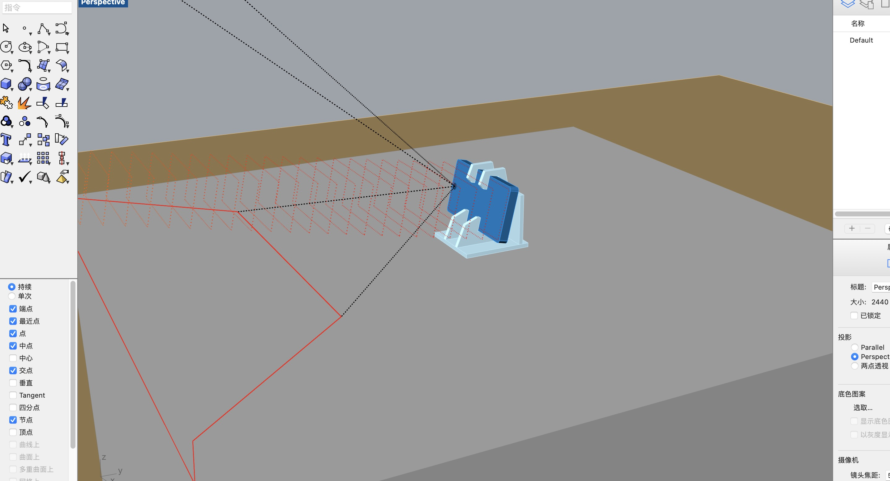
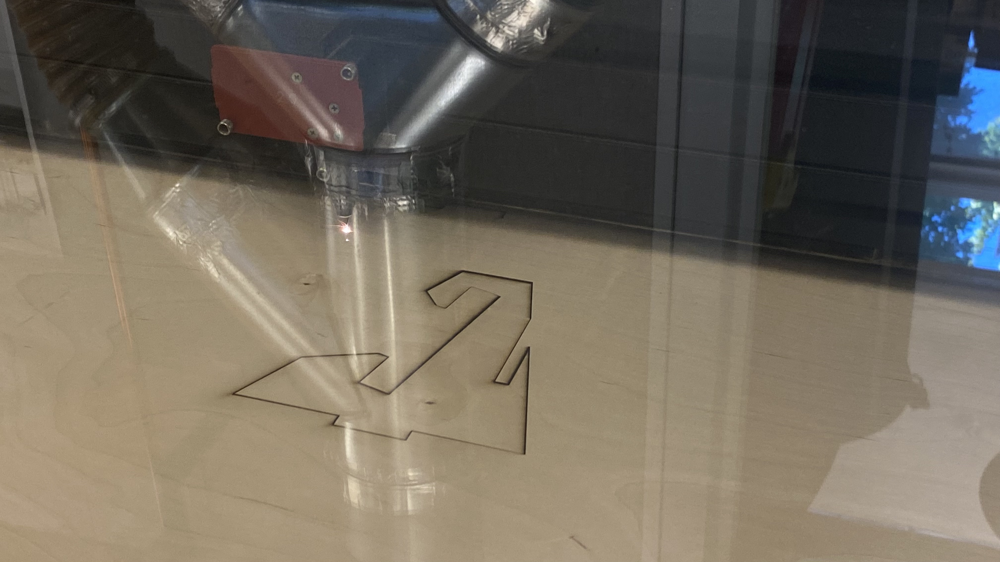
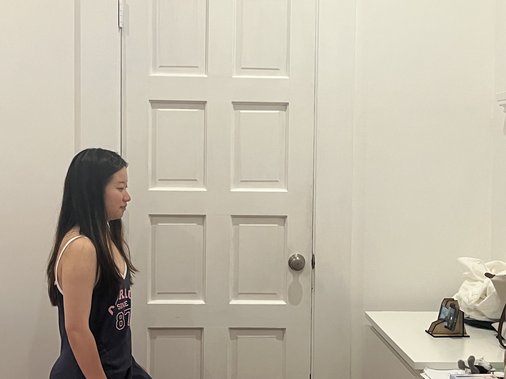

# Qu Xinyu Hiro's Document

## Week one report

### Breif：
This week, I have completed the adjustments, output, and laser cutting process for existing files in Rhino and Grasshopper.

I first measured: 1. The length and width of my phone. 2. The approximate angle and height when I'm maintaining a normal distance from the table.

I became familiar with the Grasshopper file and the corresponding adjustable sliders.

I exported a file in AI format. It's important to ensure that:
1. The AI file is in RGB mode.
2. The string in AI: 0.001 inch = 0.072 pt red: cutting, black: non-penetrating.   

I selected a piece of wood and measured its thickness. Then, I adjusted the material, parameters, and starting point on the red laser cutting machine. Afterward, I initiated the cutting process. The entire procedure went smoothly, and soon my piece of wood was cut precisely as needed.

Later, I assembled my phone stand and attempted to place my phone on it. I compared my standing position, opened the front-facing camera, and checked if the ergonomics were suitable for comfortable use.

I believe that by pre-measuring the individual dimensions and requirements of each person and using the same file to modify parameters for the battery assembly, it's possible to rapidly generate various files and engage in the intriguing process of fabrication. Throughout this process, I consider the utilization of computer-based measurements and AI assistance to be a trend that enables the mass production of customized products with greater efficiency and scalability.
